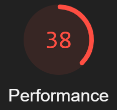
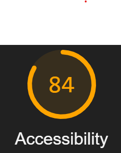
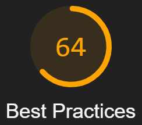

# Análise superficial do portal globo.com através da ferramenta GoogleLighthouse

### A análise resultanto pode ser visualizada [neste link](https://nicacioliveira.github.io/avaliacao-arquitetural-arqsoft-20203/relatorio-globo.com.html)

    

# Avaliação sobre o carregamento da página.

Nessa avaliação, observei que mesmo que o software rode mais algumas vezes a performance não varia mais que a média de 6s para que a página carregue por completo. Do ponto de vista do usuário, 6 segundos é um tempo alto, porém existem ressalvas sobre essa avaliação feita pela ferramenta.

A principal avaliação aqui está em identificar o tamanho dos arquivos, a minificação de scripts, o uso de arquivos estáticos (imagens, css etc), o tamanho da página em relação a quantidade de elementos, o bloquei do dom para carregamento e o tempo de renderização da primeira parte visual da tela.

## Problemas

Os principais problemas encontrados aqui estão relacionados ao uso de javascript excessivo, ou seja, que não será utilizado, levando a perda de mais de 1s no carregamento. O uso de não estaticos que poderiam estar em algum servidor de estáticos mas estão vindo direto do servidor da própria aplicação em diversos locais e o uso excessivo de scripts de terceiros.

## Acertos

O uso correto do javascript e o tamanho correto das imagens de acordo com aquilo que é visto são os pontos mais fortes e que contribuem para o carregamento rápido da página

## Considerações

É importante entender que esse número aparentemente baixo da avaliação de performance pode não representar a realidade em outros browsers e clientes. Também é importante lembrar que os requisitos para a visualização da página podem exigir que o carregamento aconteça da forma citada para que o conteúdo sej avisualmente agradável e útil para o usuário final

---

    

# Avaliação sobre acessibilidade do site

O LightHouse avalia acessibilidade em relação ao uso de cores muito distintas, claras ou escuras demais, sequência de tags, nomes, títulos e rótulos em tags que são utilizados para suprir acessibilidade em sites etc.

Por exemplo, o uso de rótulo scom a descrição do que uma imagem significa é importante para a acessibilidade do site no sentido de indicar o que aquela imagem está expressando.

## Problemas

Basicamente cores muito clares o que prejudica a navegação para algumas pessoas e elementos sem título ou rótulo.

## Acertos

Atributos com "aria" do html bem utilizados, botões e links com nomes acessíveis e discerníveis etc. 

## Considerações

Em acessibilidade o site está dentro de um nível aceitável, com poucos problemas estruturais do ponto de vista da marcação da página.

---

    

# Avaliação sobre boas práticas do site

Em boas práticas a ferramenta verifica se a página está seguindo boas práticas de padrões web. Por exemplo, uso de https, erros no console, requisições para APIs obsoletas, proporções em imagens corretas etc.

Abaixo alguns pontos sobre o resultado

## Problemas

Foram encontradas algumas requisições para serviços que não utilizam https e isso é considerado um problema do ponto de vista da proteção dos dados que estão sendo enviados por essas requisições.

Segundo o lighthouse, os scripts de aviso sobre o uso de cookies do portal, podem conter problemas relacionados a origem cruzada.

Também foi percebido que o portal utiliza um aversão muito antiga do JQuery o que pode ser uma falha do ponto de vista de que a biblioteca pode conter falhas de segurança por estar em uma versão antiga.

## Acertos

Todoas as imagens do portal foram cuidadozamente dimensionadas, o html possui a marcação esperada pelos padrões aceitos na web, evita cache de aplicativo (webapps) etc.

## Considerações

Um ponto interessante dessa análise é que o lighthouse indicou o uso de uma versão obsoleta do JQuery mas ao mesmo tempo indica que o site possui como ponto positivo o não uso de bibliotecas obsoletas deixando a análise um pouco confusa.

---

    

# Avaliação sobre SEO

Aqui ocorre uma verificação sobre se a página está otimizada para que robos de mecanismos de busca consigam indexar o conteúdo sem maiores problemas.

## Problemas

Praticamente nenhum ponto ruim nesse caso. Apenas um alerta sobre botões e links e seus tamanhos, porém, nada grave que diminua a nota nesse ponto.

## Acertos

Todas as tags necessárias para robos estão certas. O uso de um arquivo robots.txt também está válido, o que faz com que a página indique o que um robô indexador pode ou não pode fazer no site. Fontes totalmente legíveis para esse aspecto e o html evita plugins.

## Considerações

